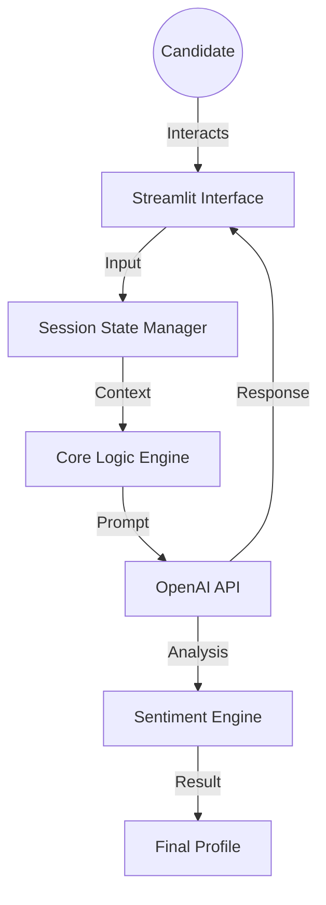

# 🤖 TalentScout AI – Intelligent Hiring Assistant

  

**TalentScout AI** is a state-of-the-art chatbot designed to streamline the technical recruitment process. It acts as an intelligent first-round interviewer, gathering candidate details, creating dynamic technical assessments based on the candidate's declared tech stack, and analyzing candidate sentiment for engagement.

## 🌟 Key Features

- **Intelligent Screening**: context-aware conversation flow to gather candidate profiles.
- **Dynamic Technical Interviews**: Generates unique, relevant technical questions on-the-fly using **OpenAI GPT-4o-mini**.
- **Adaptive Tech Stack Handling**: Understands and normalizes diverse technology inputs (e.g., "ReactJS", "react", "React.js").
- **Sentiment Analysis**: Analyzes candidate responses for enthusiasm and professional tone (Bonus Feature).
- **Premium UI**: A polished, dark-mode interface with progress tracking and smooth interactions.

## 🛠️ Installation & Setup

### Prerequisites
- Python 3.8 or higher
- An [OpenAI API Key](https://platform.openai.com/)

### 1. Clone the Repository
```bash
git clone https://github.com/yourusername/talentscout-ai.git
cd talentscout-ai
```

### 2. Install Dependencies
```bash
pip install -r requirements.txt
```

### 3. Configure Environment
Create a `.env` file in the root directory and add your API key:
```env
OPENAI_API_KEY=sk-proj-...
```

### 4. Run the Application
```bash
streamlit run app.py
```

## 🧠 Prompt Design Strategy

The core of TalentScout AI relies on distinct personas and specialized prompts to ensure reliability and context:

1.  **System Persona**: The LLM is instructed to be "TalentScout", a professional yet approachable recruiter. It is strictly bound to the hiring context.
2.  **Zero-Shot Extraction**: We use specific formatting instructions (e.g., "Output as a comma-separated list") to reliably extract structured data like tech stacks from natural language.
3.  **Contextual Generation**: Technical questions are generated by injecting the candidate's specific years of experience into the prompt, ensuring the difficulty curve is appropriate (e.g., Senior vs. Junior questions).
4.  **Sentiment Layer**: A separate analysis prompt runs in the background at the end of the session to evaluate the aggregate "vibe" of the conversation.

## 🏗️ Architecture



## 🏆 Challenges & Solutions

-   **Challenge**: Getting the LLM to ask only *one* field at a time during information gathering.
    -   **Solution**: Implemented a state-machine architecture in Python (`stage` variable) rather than relying solely on the LLM to manage flow. The LLM is used primarily for *generating* content (questions, greetings) rather than controlling the logic loop.

-   **Challenge**: Handling vague tech stack inputs.
    -   **Solution**: Added a validation step where the candidate's input is normalized, and if ambiguous, the Fallback Mechanism gracefully asks for clarification.

## 📜 License

This project is open-source and available under the MIT License.
